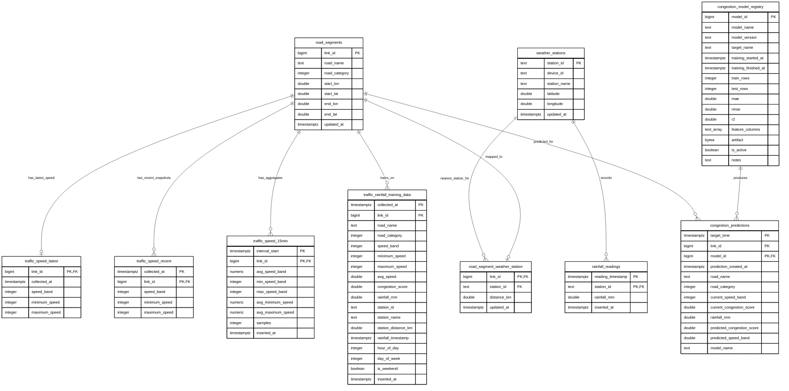

# Database ER Diagram

```mermaid
%%{init: {
  "theme": "base",
  "themeVariables": {
    "background": "#ffffff",
    "mainBkg": "#ffffff",
    "primaryColor": "#ffffff",
    "primaryBorderColor": "#000000",
    "primaryTextColor": "#000000",
    "lineColor": "#000000",
    "edgeLabelBackground": "#ffffff",
    "tertiaryColor": "#ffffff",
    "fontFamily": "Arial"
  }
}}%%
erDiagram
    road_segments {
        bigint link_id PK
        text road_name
        integer road_category
        double start_lon
        double start_lat
        double end_lon
        double end_lat
        timestamptz updated_at
    }

    traffic_speed_latest {
        bigint link_id PK, FK
        timestamptz collected_at
        integer speed_band
        integer minimum_speed
        integer maximum_speed
    }

    traffic_speed_recent {
        timestamptz collected_at PK
        bigint link_id PK, FK
        integer speed_band
        integer minimum_speed
        integer maximum_speed
    }

    traffic_speed_15min {
        timestamptz interval_start PK
        bigint link_id PK, FK
        numeric avg_speed_band
        integer min_speed_band
        integer max_speed_band
        numeric avg_minimum_speed
        numeric avg_maximum_speed
        integer samples
        timestamptz inserted_at
    }

    weather_stations {
        text station_id PK
        text device_id
        text station_name
        double latitude
        double longitude
        timestamptz updated_at
    }

    rainfall_readings {
        timestamptz reading_timestamp PK
        text station_id PK, FK
        double rainfall_mm
        timestamptz inserted_at
    }

    road_segment_weather_station {
        bigint link_id PK, FK
        text station_id FK
        double distance_km
        timestamptz updated_at
    }

    traffic_rainfall_training_data {
        timestamptz collected_at PK
        bigint link_id PK
        text road_name
        integer road_category
        integer speed_band
        integer minimum_speed
        integer maximum_speed
        double avg_speed
        double congestion_score
        double rainfall_mm
        text station_id
        text station_name
        double station_distance_km
        timestamptz rainfall_timestamp
        integer hour_of_day
        integer day_of_week
        boolean is_weekend
        timestamptz inserted_at
    }

    congestion_model_registry {
        bigint model_id PK
        text model_name
        text model_version
        text target_name
        timestamptz training_started_at
        timestamptz training_finished_at
        integer train_rows
        integer test_rows
        double mae
        double rmse
        double r2
        text_array feature_columns
        bytea artifact
        boolean is_active
        text notes
    }

    congestion_predictions {
        timestamptz target_time PK
        bigint link_id PK
        bigint model_id PK, FK
        timestamptz prediction_created_at
        text road_name
        integer road_category
        integer current_speed_band
        double current_congestion_score
        double rainfall_mm
        double predicted_congestion_score
        double predicted_speed_band
        text model_name
    }

    road_segments ||--o| traffic_speed_latest : has_latest_speed
    road_segments ||--o{ traffic_speed_recent : has_recent_snapshots
    road_segments ||--o{ traffic_speed_15min : has_aggregates
    road_segments ||--o| road_segment_weather_station : mapped_to
    weather_stations ||--o{ rainfall_readings : records
    weather_stations ||--o{ road_segment_weather_station : nearest_station_for
    road_segments ||--o{ traffic_rainfall_training_data : trains_on
    congestion_model_registry ||--o{ congestion_predictions : produces
    road_segments ||--o{ congestion_predictions : predicted_for
```
